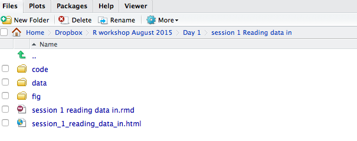
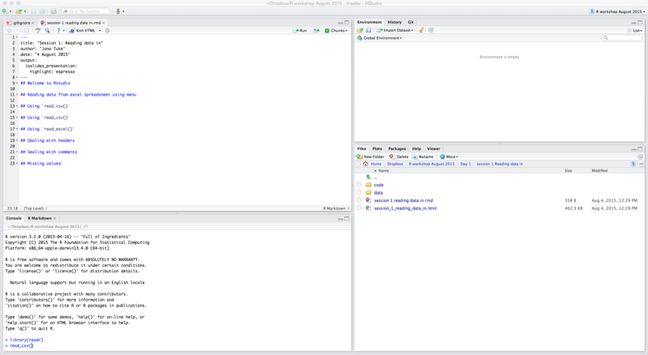
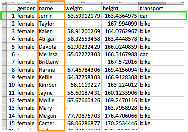
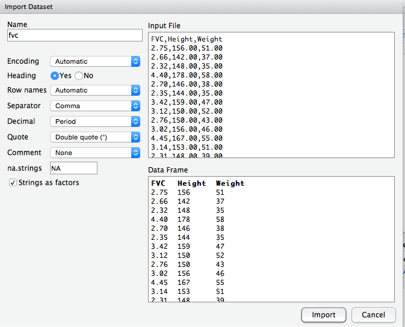
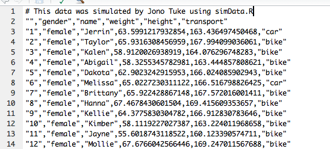
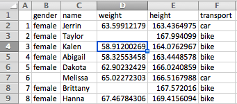

## Structure
* The slides are in the session 1 folder of the course material
* The code is in the code folder in the session 1 folder
* All the data is in the data folder



## Welcome to Rstudio



## DIY time

* Open Rstudio and familiarise yourself with its components

## Structure of data

* Each row is a subject
* Each column is a variable
* Start at A1 cell
* KISS




## Reading data from excel spreadsheet using menu

* Open data in excel
* Export as `csv` using `Save as`
* Click on `Import dataset` in Rstudio


* Choose `From Text File`

----



## Using `read.csv()`
Alternatively we can just type
```{r}
fvc <- read.csv("data/fvc.csv")
```
Check it works
```{r}
head(fvc)
```

## DIY time
* Open rstudio
* Load fvc data using menu
* Create script file
* Type in command to load `fvc` data and run

## Using `read_csv()`
There is a new package called `readr` that has an improved function to read in csv's. 

```{r}
library(readr)
fvc <- read_csv("data/fvc.csv")
head(fvc)
```

## What's the difference

* Better parser of data
* Faster
* Does not autoconvert to factors
* Converts to `tbl_df` form

## DIY time
* Use `read_csv` to read in fvc data

## Using `read_excel()`
To read in directly from excel the best way is the `read_excel()` function in the `readxl` package

```{r}
library(readxl)
fvc <- read_excel("data/fvc.xlsx")
head(fvc)
```


## Dealing with headers
Most functions in R assume that the first row contains the names of the variables.

If it does not that you must let R know.

```{r}
no_header <- read.csv("data/no_header.csv", header = FALSE)
no_header <- read_csv("data/no_header.csv", col_names = FALSE)
```

## Dealing with comments
Some data will have comments at the start with metadata. 



You need to let R know

## DIY time

* Load the `comments.csv` datafile
* Load the `no_header.csv` datafile
* Load the `no_header.xlsx` datafile

## Missing values

R copes best if the missing data is represented by an empty cell in the spreadsheet



If you use something else, e.g., `-`, `99`. You need to let R know.

```{r}
missing <- read_excel("data/missing_data2.xlsx", na = "-")
```

