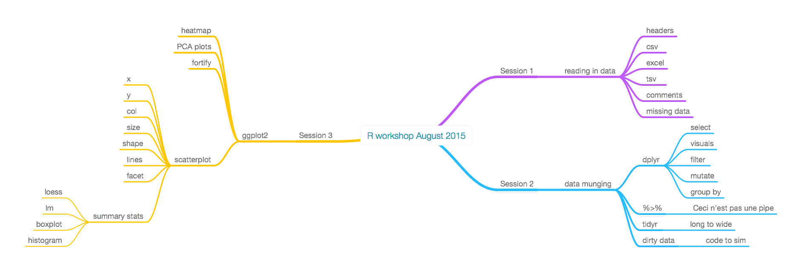

In this session we will show you a few ways to get data in from text files and excel files. 

# Getting the data
First we need to download the data. 
The data is found in `here.xls`

```{r}
y <- rnorm(100)
head(y)
```



```{r}
hist(y)
```

$y=x^2$

# Using menu to load data

# Using commands to load data

# Dealing with headers

# Dealing with comments

# Dealing with missing values
